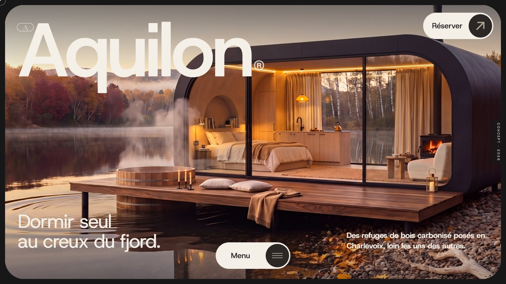

<div align="center">

# Aquilon

#### Refuges contemporains au creux du fjord de Charlevoix.

</div>

<br>



<br>

---

<br>

## À propos

Site portfolio éditorial pour **Aquilon**, marque fictive de trois refuges architecturaux posés dans la forêt boréale de Charlevoix. Récit narratif au scroll lent, contemplatif — wordmark hero, manifeste défilant, médaillons parallaxés, slideshow épinglé des trois refuges, panneau de réservation à droite.

Marque, copie et imagerie 100 % originales. Concept design, pas un service réel.

<br>

---

<br>

## Stack

<br>

| | |
|---|---|
| **Framework** | Next.js 16 · React 19 · App Router |
| **Langage** | TypeScript 5 |
| **Styling** | Tailwind CSS v4 · `@theme` tokens |
| **Animation** | GSAP 3.15 · ScrollTrigger · `@gsap/react` |
| **Smooth scroll** | Lenis |
| **Forms** | Server Actions · Zod |
| **Typographie** | Host Grotesk |

<br>

---

<br>

## Structure

<br>

Le code applicatif vit sous `src/` ; la racine ne garde que la configuration et
les assets statiques.

```
src/app/            # App Router · layout · globals.css (tokens Tailwind v4)
src/actions/        # Server Actions (validation Zod)
src/components/
  common/           # Primitives réutilisables · contexts (Menu, Reserve, SmoothScroll)
  layout/           # Header
  sections/         # 7 sections de la page d'accueil
src/lib/            # SITE_CONFIG · données refuges · timing GSAP partagé
src/hooks/          # Hooks React
docs/               # Documentation et captures
public/             # Logos · images · vidéos — reste à la racine
```

<br>

---

<br>

## Lancement

<br>

```bash
pnpm install
pnpm dev          # http://localhost:3001
```

`pnpm build && pnpm start` pour la production · `pnpm lint` pour ESLint.

<br>

---

<br>

<div align="center">

**Patrick Patenaude** · Montréal · 2026

</div>
